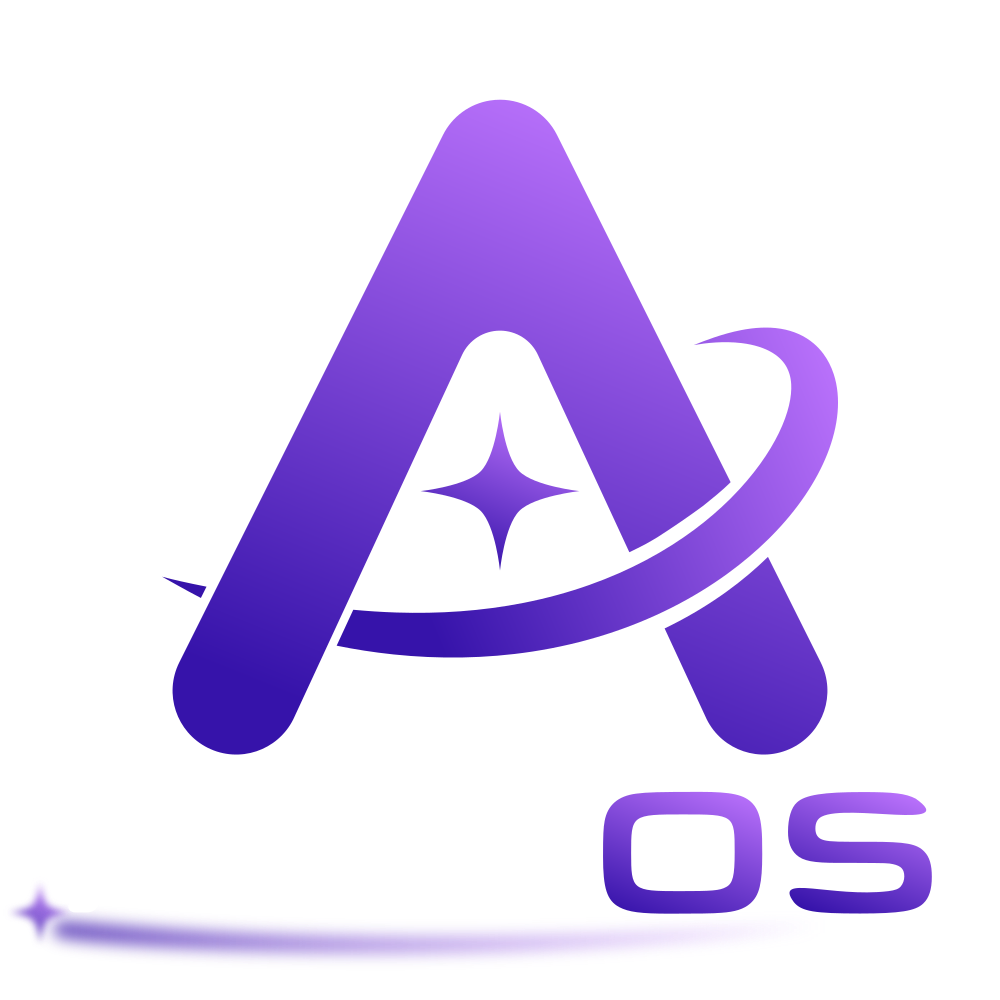

  

[![AstrOS](https://img.shields.io/badge/AstrOS-Website-3613AA?style=for-the-badge&logo=data:image/svg%2Bxml;base64,PHN2ZyB4bWxucz0iaHR0cDovL3d3dy53My5vcmcvMjAwMC9zdmciIHZpZXdCb3g9IjAgMCA2NzYgNjc2IiBmaWxsPSIjZmZmIj48cGF0aCBkPSJNODU3LjYgMzY0LjdjLTkuMS4zOTY3OS0xOC4yIDEuNi0yNy4yIDMuNC0yNS4zIDQuOS00OSAxNC4xLTY0LjQgMjAuMyAxNi42LTMgNDEuMi01LjYgNjUuMS0yLjcgMTcuMSAyLjEgMzEuNCA2LjcgNDIuMyAxMy40IDEwLjEgNi4yIDE2IDEzLjUgMTkuNSAyMC40IDEuNCAyLjggMi40IDUuNSAzLjMgOC4yIDEuMyA0LjIgMi4xIDguOSAyLjQgMTMuOS40NjE0NyA4LS4zMzg1NyAxNy43LTMgMjkuMS0yLjYgMTEtNyAyMy41LTEzLjcgMzcuMy0xMi42IDI2LTMzLjUgNTYuNy02NC43IDg4LS44OTQ5NS45LTEuOCAxLjgtMi43IDIuNy0yNi4xIDI1LjgtNjMuMSA1NS41LTExMy4yIDgyLjEtNDcuMyAyNS4yLTEwMi45IDQ1LjYtMTY2LjUgNTguMi01NyAxMS4yLTExNSAxNS0xNzMgMTMuMS0yMC41LS42NjM1Ny00MC4xLTItNTguNy0zLjgtLjAwMDk3LS4wMDAwOS0uMi0uMDAzIDBsLTIyLjYgNDguOGMyNC4xIDQuOSA1MCA5LjEgNzcuNCAxMS45IDYxLjcgNi40IDEyNS4zIDUuOCAxODguNS0zLjkgNzAuOC0xMC44IDEzNC0zMS44IDE4OC42LTU5LjIgNTcuOC0yOSAxMDEuMy02Mi45IDEzMi41LTkzLjYgMS4xLTEuMSAyLjItMi4xIDMuMi0zLjIgMzcuMS0zNy4zIDYyLjYtNzYuMyA3Ny0xMTIuNyA3LjctMTkuMyAxMi40LTM4LjMgMTQtNTYuMiAxLjctMTguNi4wMTE4LTM2LjQtNS4yLTUyLjQtMy4zLTEwLjEtOC0xOS4zLTEzLjktMjcuNS0zLjgtNS4xLTguMi05LjktMTMuMi0xNC4yLTEyLjYtMTAuNy0yNy45LTE3LjMtNDQuOC0yMC4xLTguOC0xLjUtMTcuOC0xLjktMjYuOS0xLjV6TTQyLjkgNzAzLjNjMTIgNi41IDMwIDE3LjEgNTIuOSAyOWw3LjctMTUuM2MtMjUuNy01LjEtNDYuNi05LjctNjAuNi0xMy42IiB0cmFuc2Zvcm09InRyYW5zbGF0ZSgtMzEuNSAtMjkuNilzY2FsZSguNzM1MzIpIi8+PHBhdGggZD0iTTUwMC4zIDU0LjdjLTQuNi0uMDE0My05LjMuMzM5NDc1LTEzLjkgMS4xLTI3LjYgNC40LTUxLjQgMjEuOC02My45IDQ2LjhMNjMuOSA4MTkuOWMtMjEuNCA0Mi44LTQuMSA5NC44IDM4LjggMTE2LjIgNDIuOCAyMS40IDk0LjggNC4xIDExNi4yLTM4LjdsMjI5LjUtNDk1LjZhNTYuOCA1Ni44IDAgMCAxIDEwMy4yIDBsMTI0LjMgMjY4LjRjNy44LTMuNyAxNS40LTcuNSAyMi44LTExLjUgNS40LTIuOSAxMC4xLTUuOSAxNS4yLTguOCAyMi40LTE0LjQgNDMuMi0yOC43IDYyLjctNDMuMSAxMi44LTEwLjMgMjUuNi0yMC42IDM1LjItMzAuMS41ODQ0OC0uNTc3NDggMS4yLTEuMiAxLjctMS43TDU3Ny41IDEwMi42Yy0xNC44LTI5LjYtNDQuOS00Ny44LTc3LjItNDcuOU04NjQuNCA2NzYuNGMtMzEuMiAzMC42LTc0LjUgNjQuMy0xMzIgOTMuMi0yLjggMS40LTUuNiAyLjgtOC41IDQuMkw3ODEuMSA4OTcuNGMyMS40IDQyLjggNzMuNCA2MC4xIDExNi4yIDM4LjcgNDIuOC0yMS40IDYwLjItNzMuNCAzOC44LTExNi4yeiIgdHJhbnNmb3JtPSJ0cmFuc2xhdGUoLTI5LjYgLTI5LjYpc2NhbGUoLjczNTMyKSIvPjxwYXRoIGQ9Ik00ODUgNTc3LjZjMTEuMi0xMS4yIDE0LjYtNDUgMTQuNi00NXYxMjBzLTMuNC0zMy44LTE0LjYtNDUtNDUuNC0xNS00NS40LTE1IDM0LjItMy44IDQ1LjQtMTV6bTI5LjIgMGMtMTEuMi0xMS4yLTE0LjYtNDUtMTQuNi00NXYxMjBzMy40LTMzLjggMTQuNi00NSA0NS40LTE1IDQ1LjQtMTUtMzQuMi0zLjgtNDUuNC0xNXoiIHRyYW5zZm9ybT0idHJhbnNsYXRlKC0zMjIuOSAtMzgxLjkpc2NhbGUoMS4zKSIvPjwvc3ZnPg==&logoColor=white)](https://astros-linux.org/)

**AstrOS** is an immutable, secure-by-default Linux distribution built on **Arch Linux** and the **COSMIC** desktop.

> [!CAUTION]
> AstrOS is **beta software**.
>
> It is stable enough for daily use, but expect bugs and the occasional
> breaking change. Keep backups of anything you care about, and please
> [report any bugs you find](https://code.astros-linux.org/AstrOS/AstrOS/issues).

[Installer](https://dl.astros-linux.org/AstrOS-installer_latest_x86-64.raw.zst)

---

## Documentation

For users and contributors, see our [Documentation](https://astros-linux.org/astros/).

## Credits & License

AstrOS is licensed under the **GNU General Public License v3** - see [`LICENSE`](./LICENSE).

The repart / sysupdate configuration are highly inspired from **[ParticleOS](https://github.com/systemd/particleos)** by systemd, Thanks!

Thanks to the OGC Collective for the [gamescope session](https://github.com/OpenGamingCollective/gamescope-session-steam).
